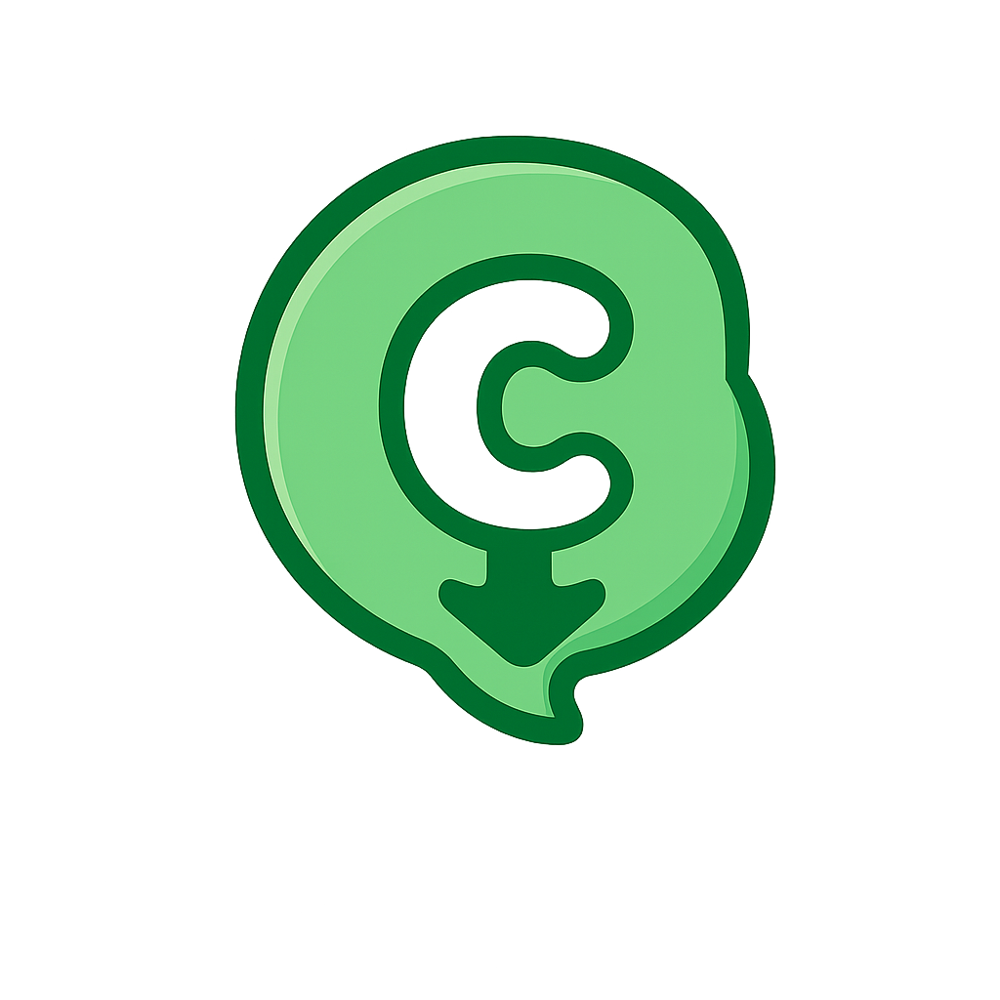

# CC-Download

  
  <h3>CCD</h3>
  <h5>轻量级视频下载工具</h5>
  
基于 Electron + React + Vite 构建的现代化桌面应用

---

## 特性

- 🚀 **简洁高效** - 现代化 UI 设计，操作流畅便捷
- 🌍 **广泛支持** - 基于 yt-dlp 引擎，支持 1000+ 视频网站
- 📦 **开箱即用** - 内置下载和处理引擎，开箱即用
- 🎨 **主题切换** - 支持浅色/深色主题，保护视力
- 💾 **下载管理** - 实时进度显示，支持批量下载
- 🎵 **音视频分离** - 支持单独下载音频或完整视频
- 🔍 **智能筛选** - 按状态和类型筛选下载记录

## 🗓️ 功能路线图

以下是计划中的功能特性，您可以通过这些功能追踪项目进展：

### 核心功能
- [x] 视频信息预览
- [x] 视频下载 (MP4)
- [x] 音频提取 (MP3)
- [x] 下载进度跟踪
- [x] 下载历史管理
- [x] 自定义下载目录
- [ ] 字幕下载
- [x] 批量下载

### 高级功能
- [x] 剪贴板自动检测
- [x] 下载完成通知
- [x] 最大活动下载数
- [x] 视频质量选择（2K/1080P/720P等）
- [ ] 从视频反找合集
- [ ] 无字幕资源时获取视频文案
- [ ] 代理设置支持

### 用户体验
- [x] 浅色/深色主题
- [x] 下载状态筛选
- [x] 音视频类型筛选
- [x] 多语言支持
- [ ] 快捷键支持

### 技术优化
- [ ] 断点续传
- [ ] 多线程下载
- [ ] 自动更新机制
- [ ] 性能优化和内存管理

> 💡 如果您有新的功能建议，欢迎提交 Issue！

## 支持的网站

CC-Download 基于 [yt-dlp](https://github.com/yt-dlp/yt-dlp) 引擎，完整支持列表请查看 [yt-dlp 支持的网站](https://github.com/yt-dlp/yt-dlp/blob/master/supportedsites.md)。

## 参与贡献

欢迎提交 Issue 和 Pull Request！如果您有任何建议或发现了问题，请随时告诉我们。

## 许可证

本项目采用 MIT 许可证。详情请参阅 `LICENSE` 文件。

## 致谢

- [yt-dlp](https://github.com/yt-dlp/yt-dlp) - 强大的视频下载引擎
- [ffmpeg-static](https://github.com/eugeneware/ffmpeg-static) - 跨平台的 FFmpeg 静态二进制文件
- [Electron](https://www.electronjs.org/) - 跨平台桌面应用框架
- [React](https://react.dev/) - 用户界面库
- [Vite](https://vitejs.dev/) - 前端构建工具
- [Tailwind CSS](https://tailwindcss.com/) - CSS 框架
- [shadcn/ui](https://ui.shadcn.com/) - UI 组件库
  
## ⚠️ 免责声明

本项目为开源学习项目，**仅供个人学习和技术研究使用**。

### 📌 使用须知

- ✅ 仅用于下载您有合法权限访问的内容
- ✅ 遵守当地法律法规及平台服务条款
- ❌ 禁止用于商业用途或传播受版权保护的内容
- ❌ 使用本工具所产生的一切后果由使用者自行承担

### 📧 版权问题

如您认为本项目侵犯了您的合法权益，请通过以下方式联系：

- 提交 GitHub Issue 并提供详细信息
- 发送邮件至 476840998@qq.com 附上相关证明

我们将及时处理您的诉求。

---

> 💡 **提示**：本软件仅作为技术工具，不存储或传播任何视频内容。
